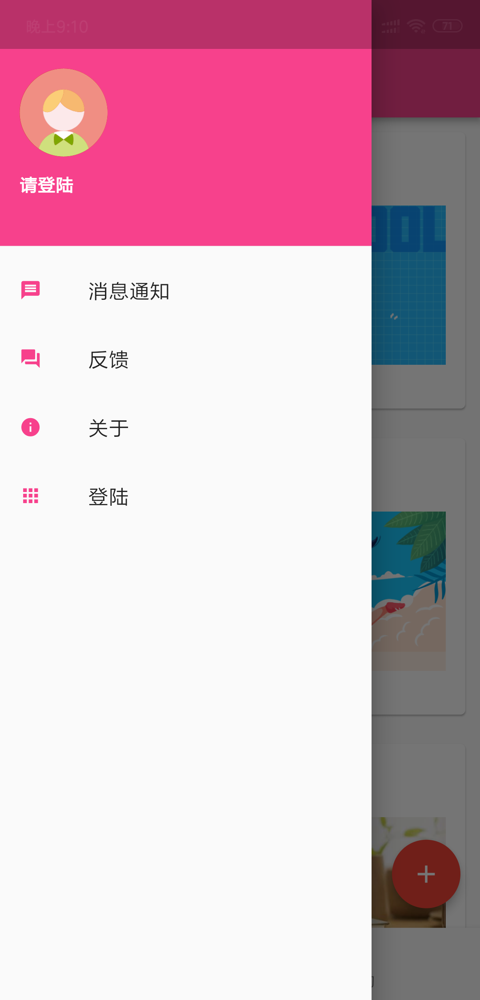

# flutter-app

#### 介绍
使用flutter开发的小目标app

#### 软件架构

#### 安装教程

1. clone仓库到你本地
2. 安装flutter运行环境，如果不会的可以关注我的公众号看教程
3. 导入工程到ide，我用的是Vscode
4. 安装依赖flutter packages get 慢的话需要替换国内镜像地址
5. 运行flutter run

#### 使用说明

1. 俄文额
2. xxxx
3. xxxx

#### 效果图

{:height="100" width="100"}

#### 关注我

